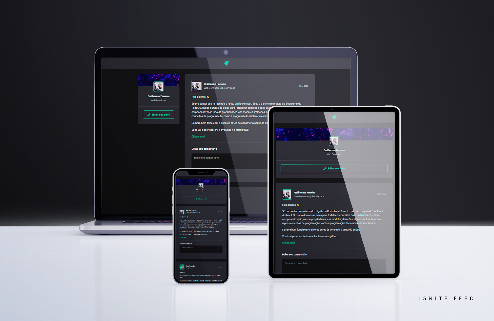

### 🚀 React JS Ignite 2022 - Project 01: Ignite Feed

##### This project was created alongside the teacher on the first module of the new Rocketseat's Ignite 2022 ReactJS Track.

 

### 💻 Screenshots

 

### 🔎 Live View

- [Live Site Link](https://01-ignite-feed.vercel.app)

 

### 🎯 Project Goal

The goal was to make basic concepts - such as CSS Modules, componentization, the use of Hooks, etc - stronger and learn new ways of doing a few old things.

 

### ⚒️ Built With

  
